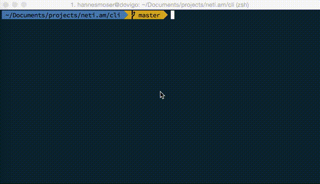

# netiam-cli

[](https://travis-ci.org/netiam/cli)
[](https://david-dm.org/netiam/cli)

> The netiam CLI tool



## Install

```bash
npm i -g netiam-cli
```

## Usage

### Create new project

```bash
netiam-cli create myapi
```

### Initialize in current directory

```bash
netiam-cli init
```

### Create new resource

```bash
netiam-cli generate resource users
```

## License

[MIT License](https://opensource.org/licenses/MIT)
